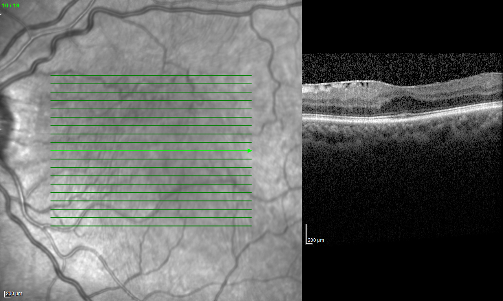
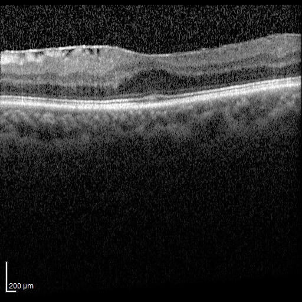
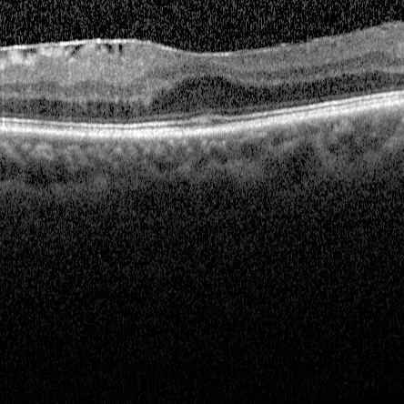

# OCT_EM_NN

This repository contains code related to creating and training a model to predict post-operative improvement in patients affected by Epiretinal Membrane.

## Model Architecture 

Both pre-operative OCT images and clinical data were available, therefore the model architecture is an hybrid between:
- A convolutional network to handle the OCT images
- Fully connected network to handle clinical data

The output layers from those subnets are concatenated and used as input for one last fully connected hidden layer before the target layer.

TODO: inserire immagine della rete

## Images preprocessing

The original image data from the OCT machine(?) is in form of a .tif file, containing both the tomography and an image of the retina with an arrow to highlight the angle from which the image was taken (then discarded), side by side.

Cropping and resizing was applied on every image original file to obtain 512x512 tomography images.

In the bottom left corner of most images there is a scale indicator. A version of every image cropped to 444x444 was created for comparison reasons.

## Clinical data preprocessing

The pre-surgical clinical features from each patient chosen for training are:
- Sex (2 classes)
- Age (Numerical)
- Pucker stage (4 classes)
- Presence of cystoid edema (2 classes)
- Ellipsoid zone disruption (2 classes)
- Central subfield thickness (Numerical)
- Central thickness (Numerical)
- Phakic (2 classes)
- Diabetes (2 classes)

Along with patient-related features, surgical configuration information was added to the input data:
- Phaco/Cataract (2 classes)
- Tamponade (2 classes)

The post-surgical features chosen for learning are:
- Presence of cystoid edema (2 classes)
- Ellipsoid zone disruption (2 classes)
- Central subfield thickness (Numerical)
- Central thickness (Numerical)

To preprocess clinical data and targets some key methods from Sklearn were used:
- LabelEncoder to encode the Sex feature notation of 'M' and 'F' into binary representation.
- OneHotEncoder to convert the 4-class pucker stage feature into 4 binary features achieving one-hot encoding.
- StandardScaler to normalize numerical values to have a mean of 0 and a standard deviation of 1.

## Data augmentation

To achieve data augmentation each image was rotated by an angle between -10° and 10°, using keras ImageDataGenerator, effectively doubling the amount of rows in the database. To augment the clinical data every numerical feature in the dataset was injected with noise randomly sampled from a normal distribution having mean 0 and standard deviation of 10% from the original features.

## Multitarget loss

The learning target is composed of 2 binary variables and 2 numerical ones. To correctly train the model it is necessary to assign a proper loss function to every output and to sum them to obtain the total loss:
- BinaryCrossEntropy for binary targets
- MeanSquaredError for numerical targets

## Management of target imbalance

The binary classes in the target are strongly imbalanced. To try and compensate a weighted cross-entropy has been assigned, computed from the class counts.

## Retraining with visus

TODO